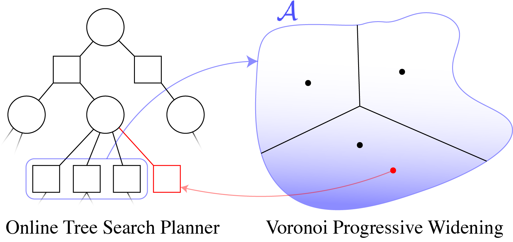

# VOOTreeSearch.jl
This is the codebase for Voronoi Progressive Widening [[Lim, Tomlin and Sunberg 2021]](https://arxiv.org/abs/2012.10140).

## Voronoi Progressive Widening for MCTS



### Summary of VPW
Voronoi Progressive Widening (VPW) extends double progressive widening (DPW) -- the new action sampling step will probabilistically sometimes sample around the best action using Voronoi Optimistic Optimization (VOO). 
This allows us to tackle continuous and hybrid action spaces of arbitrary dimensions.

VOO partitions the action space into Voronoi diagrams, which in practice only requires us to define a distance metric. 
Then, sampling from the best Voronoi cell is equivalent to rejection sampling until our sample is the closest to the best Voronoi cell center compared to other Voronoi cell centers. 
Realistically, this is more practically done with rejection sampling through sampling from a Gaussian centered at the current best action. 
We also add in the heuristics of VOO sampling only a certain amount of iterations as well as auto-accepting within a small radius in order to limit computation time. 
The details on the logistics can be found in the arXiv version of the paper linked above.

### Applying VPW to MCTS
To apply VPW to the MCTS method using the JuliaPOMDPs.jl framework, it can be easily done so by extending the existing algorithm with a DPW procedure, and adding in the VOO function as the new action selection mechanism. 
Simply put, VPW is DPW with ``next_action`` set as VOO.

For instance, in order to extend POMCPOW into VOMCPOW, we specify the following:

```
# Define the VOO hyperparameters
p_voo = [Probability for VOO exploration]
sig = [Covariance Matrix]
epsilon = [Auto-acceptance Radius]
halt = [Boolean for using max VOO iterations]
max_voo = [Max VOO iterations]

# Define the VOO sampler
voo_opt = VOOActionGenerator(p_voo, Distributions.Uniform(), MvNormal(sig), rng, epsilon, halt, max_voo)

# Adapt it to a solver with DPW
solver = POMCPOWSolver([...args...],
						next_action = VOORolloutFirst(voo_opt, rollout_policy),
						[...args...]
                      )
```

Here, ``VOORolloutFirst`` is a wrapper function for the next action selector, such that it takes the rollout policy action to be the first action sample for the node, and then next time it visits the node it will perform VPW.
If we do not want this, we can simply put in ``voo_opt`` as the ``next_action`` argument.

### Using VPW for other continuous action problems
In order to use VPW for other continuous action problems, it is necessary to define some helper functions.
In particular, for a new action space ``ExampleActionSpace`` with the action type ``ExampleAction``, VPW would require defining the following functions:

```
function action_dist(a1::ExampleAction, a2::ExampleAction)
	# Returns distance between two actions
	...
end

function action_sample_centered(best_a::ExampleAction, sampler, a_space::ExampleActionSpace)
	# Returns action sample centered at the best action
	...
end
```
It would also require the ``rand`` function for that action space to be defined as well.

### Defining VPW/VOO for other search tree structures
VPW operates by relying on the DPW functionality of the existing MCTS solver.
Currently, we have made VPW to support interfacing with the tree structures of POMCPOW and MCTS-DPW.
This covers most of the application cases for VPW.
If one wishes to use a solver with a different tree structure than the above two, then one may do so by creating a ``voo_sample`` function with the following rough code template.

```
function voo_sample(f::VOOActionGenerator, problem, state, history/tree)
	# Extract actions
	a_list = [List of actions from state_node]
    a_space = [Action space]
    values = [List of Q-values]

    # Determine explore vs. exploit
	w = rand(f.exploration_sampler)
	
	if w <= f.exploration_prob || length(a_list) <= 1
		# Uniform sample from action space for the VOO Exploration
		a_new = rand(f.action_rng, a_space)
	else
		# VOO sample from action space
	    # Extract Q values
		q_list = [values[a] for a in a_list]

	    # Find the best value
	    a_new = voronoi_sample_centered(f, a_list, q_list, a_space)
	end
    return a_new
end
```


## Reproducing the Experiments
In order to fully run the experiments, it will require the BOMCP package and the modified lunar lander script from Mern et al. (2020), which we have obtained directly from the authors of the paper.
However, the experiments can still be run by commenting out relevant parts that include BOMCP and lunar lander.
We will be updating this repository as the relevant codes become public.

- For the LQG and VDP Tag experiments, the parts containing BOMCP are commented out with a comment "Requires BOMCP". Among the experiment scripts, this only affects the ``LQG/action_compare.jl`` file.
- For the lunar lander experiments, nothing is commented out but will require the BOMCP and the ``lander_po.jl`` file to be run. 
The ``lander_po.jl`` file requires additional edits to interface with VPW -- namely additional functions are needed to sample actions from the lander action space.

Furthermore, many of these scripts are designed to be run in parallel on a SLURM-based cluster, but it is possible to run the experiments on a local machine.
It requires at least 5 threads to run locally, but you may modify that requirement by adjusting the number of additional workers inside ``addprocs(4)`` commands in these four scripts below.

### LQG Experiment
- For the action scatter plot comparison of POMCPOW, VOMCPOW, BOMCP, and VOWSS, run ``julia --project scripts/LQG/action_compare.jl``
- For the action distance comparison of VOWSS for different state and action widths, run ``julia --project scripts/LQG/vowss_table.jl``

### VDP Tag Experiment
- For the performance comparison of POMCPOW and VOMCPOW, run ``julia --project scripts/VDPTag2/compare.jl``

### Lunar Lander Experiment
- For the performance comparison of POMCPOW, VOMCPOW and BOMCP, run ``julia --project scripts/Lander/compare.jl``. 


## Development Notes (01/22/2021)
We have written the relevant functions for VOSS as well, but we have not tested them. Since VOSS is not a practical algorithm, nor is it the first of its kind to offer theoretical convergence guarantees, we only provide the code to guide what the code should roughly look like.
